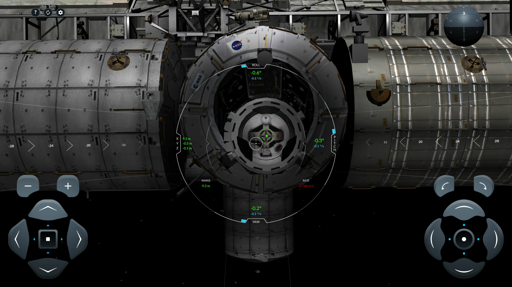
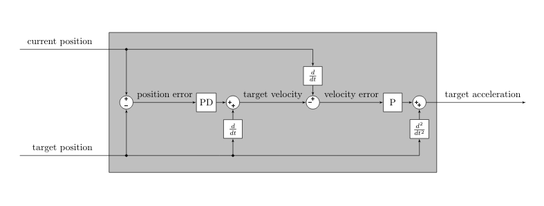
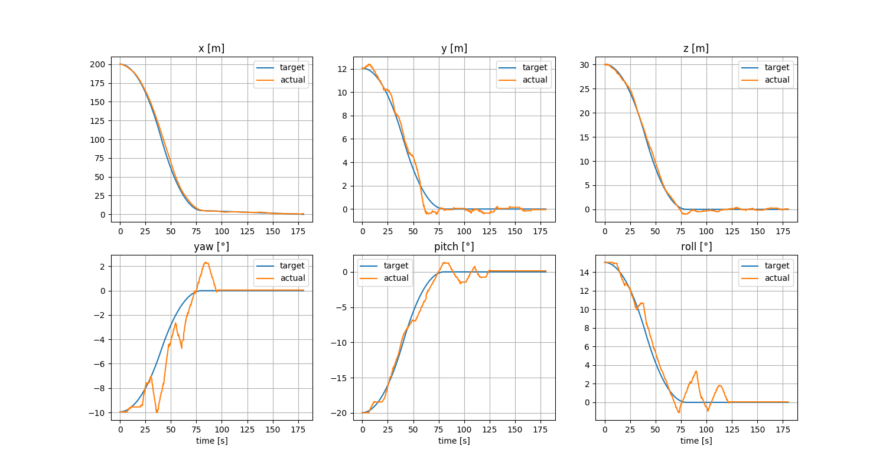

# ISS Docking Automation

This is autonomous flight software created to control the Crew Dragon spacecraft in [ISS Docking Simulator](https://iss-sim.spacex.com/) by SpaceX. Watch [this video](https://youtu.be/6vhx4n7RxOc) to see how the complete system behaves.



### Control system design

Two levels of feedback loops have been introduced. Trajectory planning module generates path position, velocity and acceleration at any given point in time. State estimation module outputs current position and velocity. These information are first used to calculate target path tracking velocity (using proportional-derivative controller) and then target acceleration (using proportional control). The same process is conducted in parallel for all 6 degrees of freedom and then the requested accelerations are converted to actuation after correcting for spacecraft orientation and scaling coefficients.



### Trajectory plotting

After each attempt, planned trajectory along with actual path of the vehicle are plotted in one figure. It can be use for debugging or for parameter tuning purposes.



## Setup instructions

### Prerequisites

- [Ubuntu 18.04](https://releases.ubuntu.com/18.04.4/)
- [ROS Melodic](http://wiki.ros.org/melodic/Installation/Ubuntu)
- [Mozilla Firefox](https://help.ubuntu.com/community/FirefoxNewVersion)
- [geckodriver](https://github.com/mozilla/geckodriver/releases)

### How to build it

```bash
mkdir -p catkin_ws/src
git -C catkin_ws/src clone https://github.com/Goldob/iss_docking_automation
cd catkin_ws
rosdep install --from-paths src
catkin_make
```

### How to run it

```bash
source devel/setup.bash
roslaunch iss_docking_automation docking_procedure.launch
```
